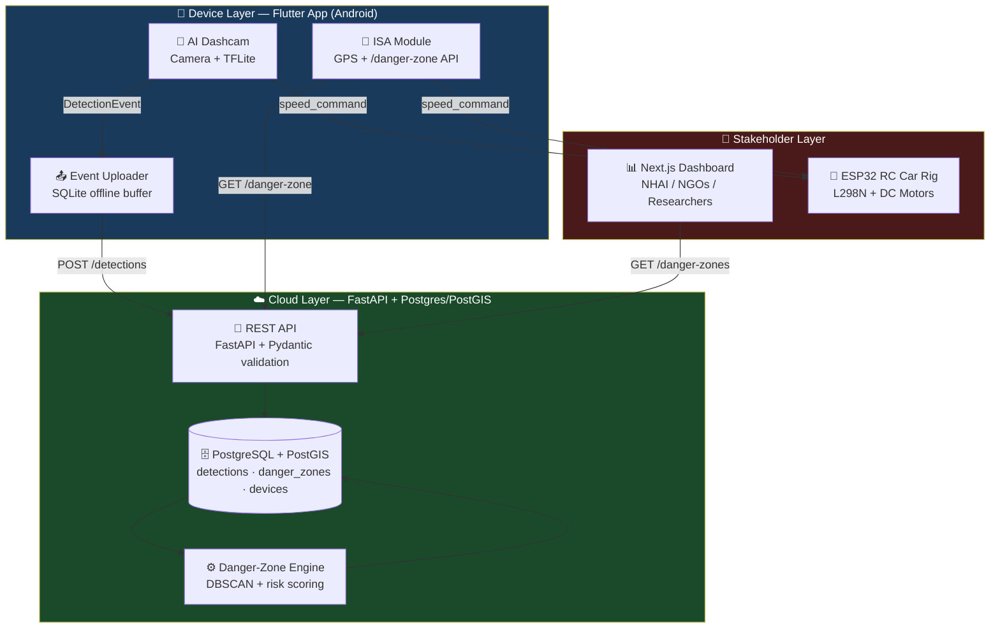
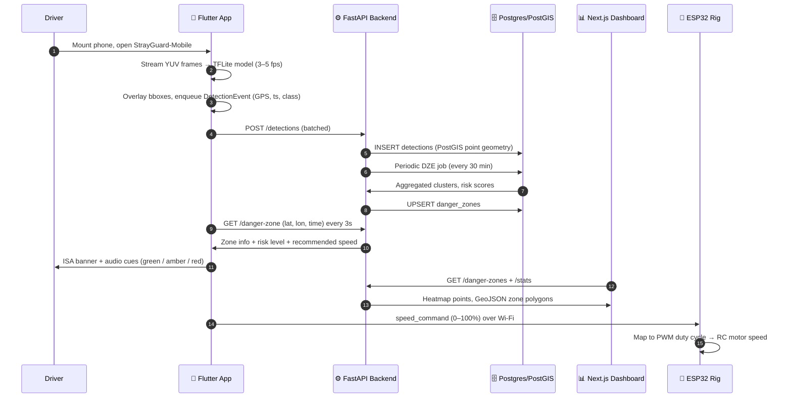
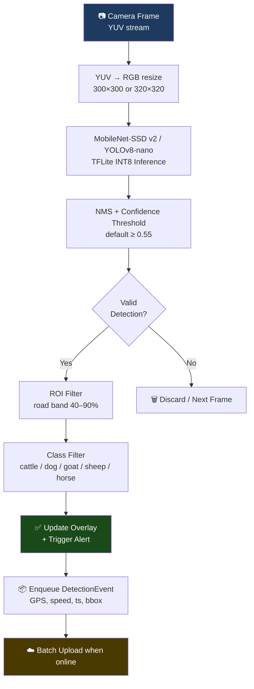
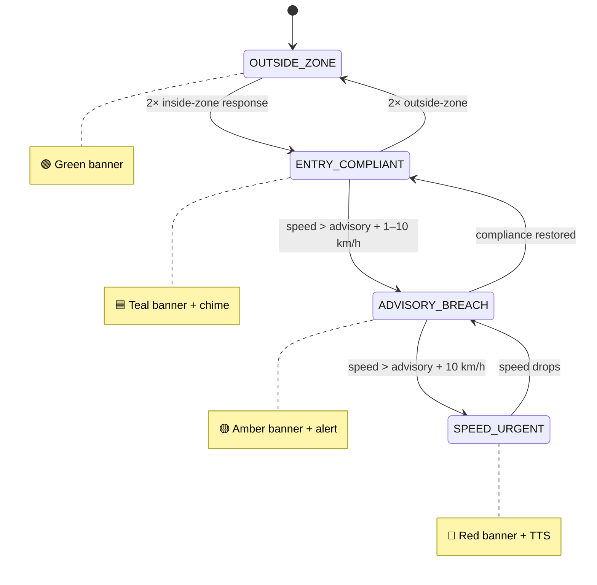
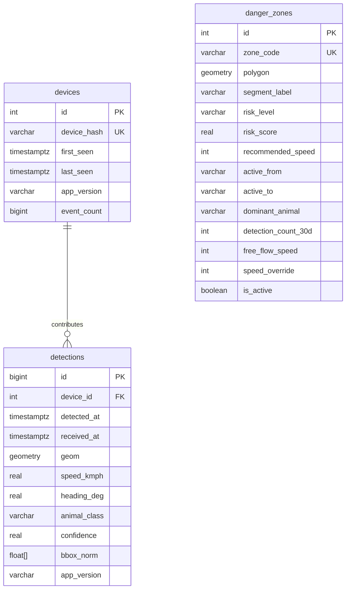
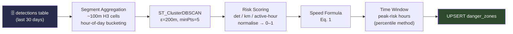
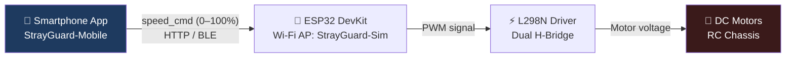

<p align="center">
  
</p>

<h1 align="center">StrayGuard‑Mobile</h1>

<p align="center">
  <b>Smartphone AI Dashcam & Intelligent Speed Assistance for Stray‑Animal Road Safety in India</b>
</p>

<p align="center">
  <a href="https://tinyurl.com/n7ryzf39"></a>
  <a href="https://strayguard.vercel.app"></a>
  
  
  
  
  
  
</p>

<p align="center">
  <i>Submitted to the National Road Safety Hackathon 2026 — Team StrayGuard Lab, Dnyanshree Institute of Engineering and Technology</i>
</p>

---

## 📋 Table of Contents

- [Overview](#-overview)
- [The Problem](#-the-problem)
- [Key Features](#-key-features)
- [Tech Stack](#️-tech-stack)
- [System Architecture](#-system-architecture)
- [End-to-End Data Flow](#-end-to-end-data-flow)
- [Mobile App (Flutter)](#-mobile-app-flutter)
- [Backend & Database](#️-backend--database)
- [Danger-Zone Engine (DZE)](#-danger-zone-engine-dze)
- [Web Dashboard (Next.js)](#-web-dashboard-nextjs)
- [Hardware Simulation (ESP32)](#-hardware-simulation-esp32)
- [AI Model](#-ai-model)
- [Getting Started](#-getting-started)
- [Testing Strategy](#-testing-strategy)
- [Deployment](#-deployment)
- [Roadmap](#️-roadmap)
- [Contributors](#-contributors)
- [License](#-license)

---

## 🔍 Overview

**StrayGuard‑Mobile** is a smartphone-based AI dashcam and **Intelligent Speed Assistance (ISA)** system that detects stray animals on Indian roads in real time, crowd-sources GPS-tagged detection events to a cloud backend, and advises drivers to reduce speed when entering data-driven danger zones.

A lightweight **ESP32 motor rig** acts as a hardware simulation to demonstrate the future concept of automatic vehicle speed reduction via OBD-II/CAN, without requiring real vehicle integration in the prototype.

```
┌───────────────┐     ┌───────────────────┐     ┌─────────────────────┐     ┌───────────────┐
│  Flutter App  │────▶│  FastAPI + PostGIS │────▶│  Next.js Dashboard  │     │  ESP32 RC Rig │
│  AI Dashcam   │     │   Cloud Backend    │     │   Authority View    │     │ Hardware Sim  │
│     + ISA     │◀────│                    │     │                     │     │               │
└───────────────┘     └───────────────────┘     └─────────────────────┘     └───────────────┘
```

---

## 🚨 The Problem

Free-roaming cattle, dogs, goats and other animals are a **persistent hazard on Indian highways**, contributing significantly to crashes, especially at night and during dawn/dusk when visibility is low.

| Existing Countermeasure | Why It Fails |
|---|---|
| Static warning signs | Drivers habituate and ignore them |
| Random speed breakers | Impractical on high-speed corridors; slow all traffic |
| Fencing | Prohibitively expensive at scale; no dynamic alerting |

> **There is no low-cost, scalable, driver-owned system that detects animals from the vehicle's perspective, accumulates collective risk intelligence, and advises the correct safe speed in real time.**

### The Physics Argument

> `KE = ½mv²` — a **20% reduction in collision speed reduces kinetic energy by 36%**. A 30% reduction cuts it by **51%**. ISA compliance in danger zones directly reduces crash severity even when a collision still occurs.

---

## ✨ Key Features

### 🐄 On-Device AI Animal Detection
- Lightweight **INT8 TFLite model** running at ~3–5 fps on the phone
- Detects **cattle, buffalo, dogs, goats, sheep and horses** using the rear camera
- ROI filtering discards sky-band and far-lane false positives
- Privacy by design: no raw frames ever leave the device

### 🗺️ Crowd-Sourced Risk Heatmaps
- Each valid detection becomes an **anonymised GPS-tagged event** uploaded to the backend
- Backend aggregates events into spatial/temporal hotspots via the **Danger-Zone Engine (DZE)**
- Any smartphone user passively contributes to a **self-improving risk map**

### 🚦 Intelligent Speed Assistance (ISA)
- App polls `/danger-zone` every ~3 s with the current GPS position
- **Colour-coded ISA banners** (green / amber / red) and audio alerts based on risk level
- 4-state hysteresis machine prevents banner flicker at zone boundaries

### 📊 Authority-Facing Web Dashboard
- **Next.js** dashboard for NHAI / city bodies / NGOs
- Live detection heatmaps with time slider, danger-zone polygons, KPI cards
- Time-series and day-of-week analytics, CSV export, admin DZE control panel

### 🔧 Hardware Simulation (ESP32 RC Car)
- ESP32 + L298N + DC motors physically demonstrate auto-slowdown
- App sends `speed_command` (0–100%) over Wi-Fi when an animal is detected or a danger zone is entered

---

## 🛠️ Tech Stack

| Layer | Technology | Purpose |
|---|---|---|
| **Mobile App** | Flutter (Android) · Riverpod · TFLite | AI dashcam, ISA overlay, event uploader |
| **Backend API** | Python 3.10 · FastAPI · Uvicorn | Event ingestion, risk scoring, REST API, Swagger docs |
| **ML Runtime** | PyTorch (CUDA 12.1) | Server-side inference / model tooling |
| **Database** | PostgreSQL · PostGIS | Spatial queries, zone clustering, heatmaps |
| **Dashboard** | Next.js · React · Leaflet · Recharts | Heatmap, zone map, analytics for authorities |
| **Hardware Sim** | ESP32 DevKit · L298N · DC motors · PlatformIO | RC car speed simulation over Wi-Fi/BLE |
| **ML Pipeline** | PyTorch / TensorFlow → TFLite INT8 | Animal detection model training & export |
| **Deployment** | Render.com (API) · Vercel (Dashboard) | Hackathon prototype hosting |

---

## 🧱 System Architecture



### Rulebook Compliance

| Requirement | Implementation | Status |
|---|---|---|
| AI/ML-based solution | On-device TFLite detection + cloud DZE clustering | ✅ Compliant |
| Road safety focus | Stray-animal–vehicle collision prevention | ✅ Compliant |
| Software prototype | Flutter + backend API + Next.js; zero roadside infra | ✅ Compliant |
| Road-Watch track | Real-time detection, heatmap, danger-zone dashboard | ✅ Compliant |
| Road-SoS track | ISA reduces approach speed, lowers crash energy | ✅ Compliant |
| Scalability | Any smartphone contributes; self-improving risk map | ✅ Compliant |
| Vehicle auto-slowdown | Demonstrated on ESP32 rig; OBD-II = future scope | 🔶 Simulated |

---

## 🔁 End-to-End Data Flow



---

## 📱 Mobile App (Flutter)

### Key Dependencies

| Package | Version | Purpose |
|---|---|---|
| `camera` | ^0.10 | Rear camera preview & frame capture |
| `tflite_flutter` | ^0.10 | On-device TFLite inference |
| `tflite_flutter_helper` | ^0.3 | Input/output tensor utilities |
| `geolocator` | ^10 | GPS lat/lon + vehicle speed |
| `sqflite` | ^2.3 | Offline event buffer (SQLite, up to 500 events) |
| `dio` | ^5 | Async HTTP client with interceptors |
| `flutter_riverpod` | ^2 | Reactive state management |
| `flutter_blue_plus` | ^1.3 | Optional BLE link to ESP32 |

### Dashcam Inference Pipeline



### ISA State Machine



---

## 🖥️ Backend & Database

### Stack

```
Language:   Python 3.10
Framework:  FastAPI + Uvicorn
ML:         PyTorch (CUDA 12.1 build)
Database:   PostgreSQL + PostGIS
Docs:       Swagger UI at /docs (OpenAPI)
```

### Database Schema



---

## ⚙️ Danger-Zone Engine (DZE)

The DZE runs as a scheduled job (every 30 min) and converts raw detection points into risk-scored, geofenced danger zones.



### Speed Advisory Formula

```
recommended_speed = max(v_min, v_free_flow × (1 − α × r))

Where:
  r           = normalised risk score ∈ [0, 1]
  α           = 0.4  (risk attenuation factor)
  v_min       = 20 km/h (hard floor)
  v_free_flow = segment baseline speed
```

### Risk Level Thresholds

| Risk Level | Score Range | Speed Reduction |
|---|---|---|
| 🟢 Low | 0.00 – 0.25 | ≤ 8% |
| 🟡 Medium | 0.25 – 0.55 | 10 – 22% |
| 🟠 High | 0.55 – 0.80 | 22 – 32% |
| 🔴 Critical | 0.80 – 1.00 | 32 – 40% |

---

## 📊 Web Dashboard (Next.js)

| Panel | Description | Audience |
|---|---|---|
| 🗺️ Heatmap | Live detection density with time slider | NHAI / Researcher |
| 📍 Zone Map | Danger-zone polygons coloured by risk level | Authority / NGO |
| 📈 KPI Cards | Total detections, active zones, top hotspot | All |
| ⏱️ Time Charts | Hourly and day-of-week detection trends | Researcher |
| 📥 CSV Export | Filtered zone/detection data export | Authority / NGO |
| ⚙️ DZE Control | Manual DZE trigger and parameter tuning | Admin |

---

## 🔧 Hardware Simulation (ESP32)

> **Label on demo table:** `Hardware Simulation — Future OBD-II/CAN Integration`

### Bill of Materials

| # | Component | Qty | Role |
|---|---|---|---|
| 1 | ESP32 DevKit V1 (30-pin) | 1 | Wi-Fi/BLE controller |
| 2 | L298N Dual H-Bridge | 1 | Motor PWM driver |
| 3 | DC Gear Motors (TT) | 2 | Drive wheels |
| 4 | RC Chassis (2WD) | 1 | Physical platform |
| 5 | 18650 Li-ion cells (2S) | 2 | Power supply |
| 6 | TP4056 BMS module | 1 | Battery management |
| 7 | Jumper wires, breadboard | – | Connections |

### Control Chain



---

## 🤖 AI Model

| Property | MobileNet-SSD v2 | YOLOv8-nano |
|---|---|---|
| Input size | 300 × 300 | 320 × 320 |
| Quantisation | INT8 | INT8 |
| Model size | ≈ 6 MB | ≈ 4.5 MB |
| Inference (mid-range Android) | 180 – 220 ms | 120 – 160 ms |
| mAP@0.5 (target) | ≈ 0.70 | ≈ 0.74 |

**Classes:** cattle, buffalo, dog, goat, sheep, horse, human (detected but no alert is triggered, privacy by design).

### Training Pipeline

```
1. Gather ≥8,000 Indian roadside animal images
   (dashcam clips, web scraping, NGO datasets)

2. Augmentations: horizontal flip · brightness jitter · motion blur
   · synthetic night/rain simulation

3. Label in YOLO format — train/val/test: 70/15/15

4. Train:
   MobileNet-SSD → TF Object Detection API (T4 GPU)
   YOLOv8-nano   → Ultralytics

5. Export: TFLite INT8 quantisation
   Benchmark on Snapdragon 680 and above

6. Validate mAP, precision, recall, FPR
   on held-out night-time subset
```

---

## 🚀 Getting Started

### Prerequisites

```bash
Python 3.10                # backend (3.10 is required for the PyTorch CUDA build)
NVIDIA GPU + CUDA 12.1     # optional, for GPU acceleration
PostgreSQL + PostGIS
Flutter >= 3.19            # mobile app
Node.js >= 20 LTS          # dashboard
PlatformIO                 # ESP32 firmware flashing
```

### 1. Clone the Repository

```bash
git clone https://github.com/<your-username>/StrayGuard.git
cd StrayGuard
```

### 2. Backend Setup (FastAPI + PyTorch)

**Check installed Python versions** (Windows):

```bash
py -0
```

If Python 3.10 is missing, install it first.

**Open the backend folder:**

```bash
cd path_to_backend
```

**Create and activate a virtual environment:**

```bash
py -3.10 -m venv venv
venv\Scripts\activate
```

**Install all dependencies:**

> ⚠️ **IMPORTANT:** the extra index URL is required because PyTorch CUDA packages are not available on normal PyPI. Without it, `torch` installation may fail.

```bash
pip install -r requirements.txt --extra-index-url https://download.pytorch.org/whl/cu121
```

**Run the backend:**

```bash
uvicorn app.main:app --reload --host 0.0.0.0 --port 8000
```

→ API: `http://localhost:8000` · Swagger docs: `http://localhost:8000/docs`

#### Optional: GPU Check

```bash
python
```

```python
import torch

print(torch.cuda.is_available())
print(torch.cuda.get_device_name(0))
```

If it prints `True` and `NVIDIA ...`, the GPU is working.

#### Troubleshooting

| Error | Fix |
|---|---|
| `No matching distribution found for torch` | Ensure Python **3.10** is used · use the exact install command above · check your internet connection |

### 3. Run Next.js Dashboard

```bash
cd dashboard
npm install
npm run dev
```

Set `NEXT_PUBLIC_API_URL=http://localhost:8000` in the dashboard `.env`.

### 4. Run Flutter App

```bash
cd mobile
flutter pub get
flutter run    # requires Android device or emulator
```

> Grant **Camera**, **Location** and **Internet** permissions when prompted.

### 5. Flash ESP32 Firmware (Optional)

```bash
cd hardware-sim
pio run --target upload
# ESP32 starts as Wi-Fi AP: StrayGuard-Sim
```

---

## 🧪 Testing Strategy

| Level | Area | Scenarios / Assertions | Tool |
|---|---|---|---|
| Unit | TFLite inference | Bounding box shape, class index range, NMS output | flutter_test |
| Unit | ROI filter | Correct exclusion of sky/hood regions | flutter_test |
| Unit | DZE risk scoring | Score formula for known input vectors | pytest |
| Unit | Speed formula | Eq. 1 boundary conditions | pytest |
| Integration | App → Backend | Event ingestion, 400/200 responses, DB row count | API tests |
| Integration | DZE → Dashboard | Zone polygon and risk level appear in API | API tests |
| Integration | ESP32 sim | Speed cmd received; motor duty cycle changes | Serial monitor |
| System | Animal detected | Overlay visible; event in DB; hotspot map updates | Manual |
| System | Zone entry | ISA advisory within 3 s of crossing boundary | Manual |
| System | Offline buffer | 200 events buffered; all upload on reconnect | Manual |

---

## 🚢 Deployment

| Component | Platform | Notes |
|---|---|---|
| Backend API | Render.com (free tier) | Python + Postgres; PostGIS extension enabled |
| Web Dashboard | Vercel | Next.js; env vars for API endpoint |
| Android APK | Sideloaded | `flutter build apk --release` |
| ESP32 Firmware | PlatformIO | Board as Wi-Fi AP `StrayGuard-Sim` |

### Live Demo Script (5–7 min)

```
1. Open app → show live dashcam preview at normal drive speed
2. Move animal cut-out in front of camera → overlay + alert appear instantly
3. Show dashboard → detection count increments, new point on heatmap
4. Simulate GPS entering pre-seeded danger zone → ISA advisory appears within 3s
5. App sends speed command to ESP32 → RC car slows from 80% to 40% duty cycle
6. Clear hazard → app returns to OUTSIDE_ZONE; RC car resumes normal speed
7. Show dashboard risk map and zone polygons; discuss future OBD-II roadmap
```

### 📹 Demo Video

👉 **Google Drive:** [https://tinyurl.com/n7ryzf39](https://tinyurl.com/n7ryzf39)

The video covers: (1) normal drive at 80% motor speed, (2) risk-zone detection and app notification, (3) automatic slowdown via ESP32, (4) return to normal speed after leaving the zone.

---

## 🛣️ Roadmap

| Phase | Feature | Details |
|---|---|---|
| **P1** | OBD-II / CAN integration | Auto-slowdown on real vehicles via ELM327 adapter |
| **P1** | Android Auto / CarPlay | Larger ISA UI on in-car infotainment screen |
| **P2** | Federated learning | Improve model without sharing raw images |
| **P2** | NHAI SMS / API integration | Push zone data to official highway alert systems |
| **P3** | iOS App Store release | After Stage-1 testing |
| **P3** | ISO 26262 pathway | Safety case documentation for OEM adoption |

```
StrayGuard App (phone)
        │ Bluetooth Classic (SPP)
        ▼
ELM327-compatible OBD-II adapter
        │ CAN bus message
        ▼
Vehicle ECU → reduces throttle / applies light braking
        ▼
Vehicle decelerates to recommended_speed
```

> The ESP32 demo validates the same logical control loop. Replacing the ESP32 HTTP endpoint with a Bluetooth OBD-II CAN write is the remaining engineering work.

---

## 👥 Contributors

**Team StrayGuard Lab**
Dnyanshree Institute of Engineering and Technology

Contributions, issues and feature requests are welcome. Please use the GitHub **Issues** and **Pull Requests** tabs.

---

## 📄 License

This project is licensed under the **MIT License**. See the [LICENSE](LICENSE) file for details.

---

<p align="center">
  
  <br/>
  <i>StrayGuard-Mobile · National Road Safety Hackathon 2026</i>
</p>
